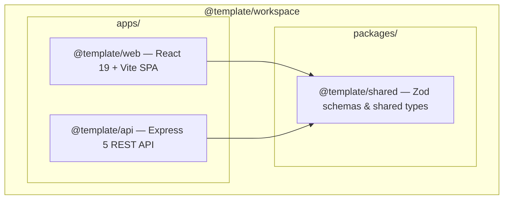
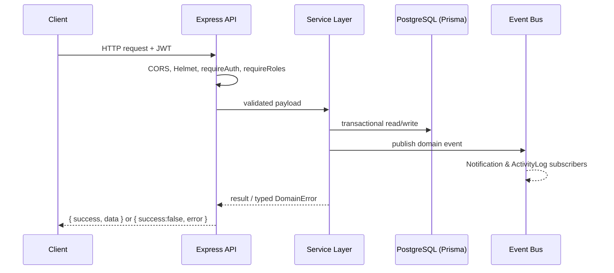
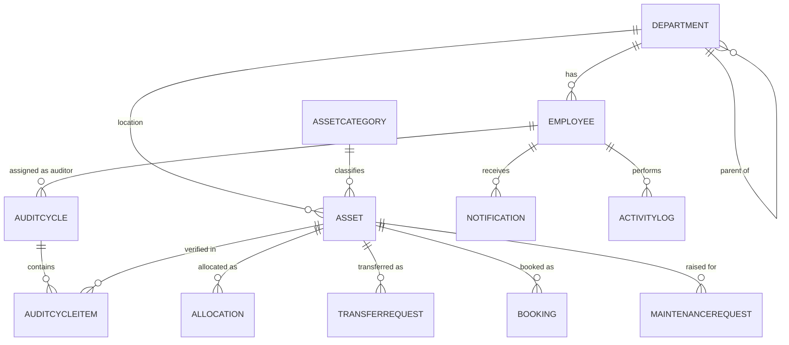

# Odoo Hackathon
# AssetFlow

**Enterprise Asset & Resource Management System** — a centralized platform for tracking, allocating, booking, maintaining, and auditing an organization's physical assets and shared resources.

Built for the Odoo Hackathon (Gandhinagar).

---

## Table of Contents

- [Overview](#overview)
- [Problem Statement](#problem-statement)
- [Features](#features)
- [Architecture](#architecture)
- [Technology Stack](#technology-stack)
- [Folder Structure](#folder-structure)
- [Database Design](#database-design)
- [Authentication & Authorization](#authentication--authorization)
- [Validation Strategy](#validation-strategy)
- [Error Handling](#error-handling)
- [API Overview](#api-overview)
- [Installation & Setup](#installation--setup)
- [Environment Variables](#environment-variables)
- [Running the Project Locally](#running-the-project-locally)
- [Development Workflow](#development-workflow)
- [Deployment](#deployment)
- [Known Limitations & Planned Work](#known-limitations--planned-work)
- [Contributing](#contributing)
- [License](#license)

---

## Overview

AssetFlow digitizes how organizations track, allocate, and maintain physical assets and shared resources, replacing spreadsheets and paper logs with structured lifecycles, role-gated workflows, and real-time visibility. It is domain-agnostic — offices, schools, hospitals, factories, or agencies can all use it to answer *who has what, where it is, and what condition it's in* — without touching purchasing, invoicing, or accounting concerns.

## Problem Statement

Manual asset tracking fails not because organizations lack data, but because spreadsheets and paper logs enforce no rules: nothing stops the same laptop from being assigned to two people, nothing prevents a room from being double-booked, and nothing gates repair work behind approval. AssetFlow's core value is enforcing those rules at the data layer, not just displaying data.

## Features

Every feature below reflects what is actually implemented and wired end-to-end (route → service → database) in this repository, unless explicitly marked otherwise.

### Implemented

| Module | Capability |
|---|---|
| **Auth** | Signup (always creates role `EMPLOYEE`, forced server-side), login (JWT), forgot/reset password, session validation (`GET /auth/me`) |
| **Organization Setup** | Department CRUD with hierarchy + circular-reference prevention, Asset Category CRUD with dynamic per-category field schemas, Employee Directory with role/status/department management |
| **Asset Registry** | Asset registration with race-condition-safe sequential tag generation (`AF-0001`, via a Postgres sequence), search/filter/pagination, retire/dispose lifecycle actions |
| **Allocation & Transfer** | Allocate assets to an employee or department with conflict detection, return flow with condition capture, full transfer-request workflow (request → approve/reject) |
| **Resource Booking** | Time-slot booking with overlap validation, cancel / start / complete / reschedule lifecycle |
| **Maintenance Management** | Request → Approve (requires technician assignment) → In-Progress → Resolve workflow, with asset status correctly reverting to `ALLOCATED` or `AVAILABLE` depending on whether an allocation was active when maintenance began |
| **Asset Audit** | Audit cycle creation with automatic in-scope asset snapshotting, auditor assignment, per-item verification (Verified/Missing/Damaged), atomic cycle closure that marks unresolved items and flips `Missing` assets to `LOST` |
| **Dashboard** | Role-scoped summary endpoint |
| **Reports** | Utilization, maintenance frequency, retirement forecast, department allocation summary, booking heatmap, and a generic export endpoint |
| **Notifications (backend)** | Event-driven notification records generated for allocation, transfer, booking, maintenance, and role-change events; list + mark-as-read endpoints |
| **Activity Log (backend)** | Append-only log of actor/action/target for key domain events |
| **File Upload** | Local disk storage for asset/maintenance attachments, served statically under `/uploads` |
| **Role-based Authorization** | Every mutating endpoint checks role server-side (`requireRoles` middleware); Admin role can never be granted through the employee role-update endpoint |
| **Rate Limiting** | In-memory IP-based rate limiting on all `/auth/*` endpoints |
| **CI/CD** | GitHub Actions pipeline running lint → typecheck → build on every push/PR to `main` |

### Partially Implemented / Frontend Gaps

These have complete backend endpoints but no corresponding UI in `apps/web` yet:

- **Notifications UI** — the dashboard header has a non-functional "Notifications" icon button; there is no notification panel or list wired to `GET /api/v1/notifications`.
- **Activity Log UI** — no frontend route or page consumes `GET /api/v1/activity-logs`.
- **Settings page** — `apps/web/src/features/settings/pages/settings-page.tsx` exists as an empty placeholder and is not registered in the router.

### Not Yet Implemented

- **Scheduled background jobs** — `booking-status-transitions` and `overdue-detection` are registered with the scheduler (`apps/api/src/lib/scheduler.ts`) but their handlers are stub log statements only (see `server.ts`). Booking status does **not** currently auto-transition from `UPCOMING` to `ONGOING`/`COMPLETED` on a timer — this happens only via the explicit `/start` and `/complete` endpoints. Overdue-return and overdue-booking detection is not yet computed anywhere.
- **Cloud/S3 file storage** — `S3StorageService` exists as a class skeleton that throws on use; only local disk storage (`LocalStorageService`) is functional. Toggle via `STORAGE_PROVIDER`.
- **Persistent password-reset tokens** — reset tokens are kept in an in-memory `Map`, not the database. They do not survive an API process restart and won't work correctly across multiple backend instances.

## Architecture

AssetFlow is a **TypeScript monorepo** using pnpm workspaces and Turborepo, with a modular-monolith Express API and a React SPA.



### Request Flow



Each backend module (`departments`, `assets`, `allocations`, `bookings`, `maintenance`, `audits`, etc.) follows a consistent **Controller → Service → Prisma** layering. Cross-cutting concerns (notifications, activity logging) are decoupled via an in-process `EventEmitter`-based event bus (`src/lib/event-bus.ts`) — a module publishes a domain event (e.g. `asset.allocated`) and subscribers in `src/subscribers/` react to it, so business modules never import notification/logging logic directly.

## Technology Stack

| Layer | Technology |
|---|---|
| Monorepo tooling | pnpm workspaces (`10.26.2`) + Turborepo (`^2.5.8`), Node.js `22` |
| Frontend | React `^19.2`, Vite `^7.2`, TypeScript `^5.9`, Tailwind CSS `^4.1` |
| Frontend state | Zustand (persisted auth store), TanStack React Query (server state) |
| Frontend forms | React Hook Form + Zod resolvers |
| Frontend UI | Radix UI primitives, class-variance-authority, Lucide icons, Recharts |
| HTTP client | Axios with JWT request interceptor + 401 auto-logout |
| Backend | Express `^5.1`, TypeScript, `tsx` (dev), compiled with `tsc` |
| Database / ORM | PostgreSQL + Prisma `^5.22` |
| Auth | JSON Web Tokens (`jsonwebtoken`), password hashing via Node's built-in `crypto.scrypt` (salted, timing-safe compare) — **not bcrypt** |
| Validation | Zod, shared between frontend and backend via `@template/shared` |
| Logging | Pino (+ `pino-pretty` in development) |
| File uploads | Multer (memory storage) → local disk (`apps/api/public/uploads`), served statically |
| Security middleware | Helmet, CORS, custom in-memory rate limiter |
| Linting/Formatting | ESLint 9 (flat config), Prettier, Husky pre-commit + `lint-staged` |
| CI | GitHub Actions (lint → typecheck → build) |
| Deployment | Railway (`railway.toml`, backend), Vercel (`apps/web/vercel.json`, frontend) |

## Folder Structure

```
Odoo-Hack-Gandhinagar/
├── apps/
│   ├── api/                      # Express backend
│   │   ├── prisma/
│   │   │   ├── schema.prisma     # Full data model (see Database Design)
│   │   │   ├── seed.ts           # Bootstrap admin + DB-level constraints
│   │   │   └── seed-dev.ts
│   │   ├── public/uploads/       # Local file storage target
│   │   └── src/
│   │       ├── modules/          # One folder per feature: auth, departments,
│   │       │                     # asset-categories, employees, assets,
│   │       │                     # allocations, bookings, maintenance, audits,
│   │       │                     # dashboard, reports, notification,
│   │       │                     # activity-logs, upload, public-metrics, health
│   │       ├── middleware/       # requireAuth, requireRoles, rateLimiter, error-handler
│   │       ├── lib/               # db client, event-bus, scheduler, errors, response, crud-factory
│   │       ├── subscribers/      # notification & activity-log event subscribers
│   │       ├── services/         # storage.service.ts, notification.service.ts
│   │       ├── routes/index.ts   # Central route mounting
│   │       ├── app.ts            # Express app factory
│   │       └── server.ts         # Entry point, scheduler + subscriber init
│   └── web/                      # React frontend
│       └── src/
│           ├── features/         # dashboard, org-setup, assets, allocations,
│           │                     # bookings, maintenance, audits, reports,
│           │                     # auth, marketing, settings (stub)
│           ├── components/
│           │   ├── shared/       # DashboardLayout, ProtectedRoute, ErrorBoundary, etc.
│           │   └── ui/           # Reusable primitives
│           ├── services/
│           │   ├── http/api-client.ts   # Axios instance + interceptors
│           │   └── data/                # Repository pattern per domain
│           ├── stores/auth-store.ts     # Zustand persisted session
│           ├── router/index.tsx         # Route tree
│           └── theme/                    # Light/dark theming
├── packages/
│   ├── shared/                   # Zod schemas & types shared by web + api
│   ├── eslint-config/
│   └── typescript-config/
├── scripts/                      # gen-module.sh, gen-feature.sh scaffolding
├── .github/workflows/ci.yml      # Lint → typecheck → build pipeline
├── .planning/                    # Local architecture/design docs (git-ignored except its own README)
├── railway.toml                  # Backend deployment config (Railway)
└── turbo.json / pnpm-workspace.yaml
```

## Database Design

PostgreSQL via Prisma. The full schema lives in `apps/api/prisma/schema.prisma`. Key entities:



**Entities**: `Department` (self-referencing hierarchy), `AssetCategory` (with a `Json fieldSchema` for per-category dynamic fields), `Employee` (roles: `EMPLOYEE`, `DEPARTMENT_HEAD`, `ASSET_MANAGER`, `ADMIN`), `Asset` (7-state lifecycle enum), `Allocation`, `TransferRequest`, `Booking`, `MaintenanceRequest`, `AuditCycle` / `AuditCycleAuditor` / `AuditCycleItem`, `Notification`, `ActivityLog`.

### Concurrency-safety guarantees actually enforced

Two correctness-critical rules are backed by real Postgres constructs, applied via `apps/api/prisma/seed.ts` (not Prisma migrations, since Prisma's schema DSL doesn't express partial indexes or sequence-based defaults):

- **No double-allocation**: `CREATE UNIQUE INDEX ... ON "Allocation"("assetId") WHERE "returnedAt" IS NULL` — enforced at the database level in addition to the application-level pre-check in `allocations.service.ts`.
- **Race-condition-safe Asset Tags**: a dedicated Postgres sequence (`asset_tag_seq`) is created and synced against existing data; `createAsset` calls `nextval('asset_tag_seq')` directly rather than reading-and-incrementing a max value, so concurrent registrations cannot collide.

Booking overlap prevention (`bookings.service.ts`) is currently enforced via an application-level transactional check (`start < existingEnd AND existingStart < end`) rather than a database-level exclusion constraint — functionally correct under normal load, but not yet backed by a Postgres `EXCLUDE` constraint the way the allocation rule is.

## Authentication & Authorization

- **Signup always creates an `EMPLOYEE`** — the role is forced server-side in `auth.service.ts` regardless of any other field submitted.
- **The `ADMIN` role can never be granted through the API.** `employees.service.ts` explicitly rejects any role-update request targeting `ADMIN`. The bootstrap Admin account is created exclusively by `prisma/seed.ts`, reading `INITIAL_ADMIN_EMAIL` / `INITIAL_ADMIN_PASSWORD` (falling back to `ADMIN_EMAIL` / `ADMIN_PASSWORD`, then to a hardcoded dev default) — there is no in-app path to becoming Admin.
- **The sole active Admin cannot be deactivated** — `updateEmployeeStatus` blocks deactivating the last `ACTIVE` Admin account, preventing the organization from ever being left admin-less.
- **JWT-based, stateless sessions.** Tokens carry `sub`, `email`, `name`, `role`, `departmentId`, verified on every request by `requireAuth` middleware. Logout is client-side only (token discarded from the persisted Zustand store).
- **Role gating** via a `requireRoles(...)` middleware applied per-route (e.g. `requireRoles("ADMIN")`, `requireRoles("ADMIN", "ASSET_MANAGER")`). Department-Head-scoped checks (e.g. "can only allocate within your own department") are enforced inside the relevant service function, not just at the route level.
- **Password hashing** uses Node's built-in `crypto.scrypt` with a random salt and `crypto.timingSafeEqual` for comparison — not bcrypt/argon2, but a reasonable, dependency-free choice.
- **Password reset** issues a random 32-byte hex token with a 15-minute expiry, held in an in-memory `Map` (see [Known Limitations](#known-limitations--planned-work)).

## Validation Strategy

- **Shape validation**: Zod schemas (defined once in `packages/shared/src/schemas/*` and imported by both apps) validate request bodies at the Express layer via a `validateRequest` middleware, and the same schemas back React Hook Form on the client.
- **Business validation**: enforced in each module's `*.service.ts` — e.g. an asset must currently be `AVAILABLE` before allocation, a maintenance request must be `PENDING` before approval, an audit cycle must be `OPEN` before an item can be marked.
- **Database-level validation**: unique constraints (`Employee.email`, `Asset.assetTag`, `Asset.serialNumber`, `AuditCycleItem(auditCycleId, assetId)`), plus the partial unique index and sequence described above.

## Error Handling

A single Express error-handling middleware (`middleware/error-handler.ts`) normalizes every failure into one JSON shape:

```json
{
  "success": false,
  "error": { "code": "CONFLICT", "message": "...", "details": { } }
}
```

- `ZodError`s are caught and reformatted into a `VALIDATION_ERROR` (400) with a `{ field, message }[]` details array.
- Domain errors (`NotFoundError`, `ConflictError`, `BadRequestError`, `UnauthorizedError`, `ForbiddenError` — all extending an abstract `DomainError` in `lib/errors.ts`) map to their respective status codes with a stable `code` string the frontend can branch on.
- Anything else is logged via Pino with full context and returned as a generic `500 INTERNAL_ERROR`, never leaking internals to the client.
- Successful responses use the same envelope shape (`{ success: true, data, message? }`) via `lib/response.ts` helpers (`sendOk`, `sendCreated`).

## API Overview

All routes are mounted under `/api/v1` (see `apps/api/src/routes/index.ts`). Full request/response contracts are documented in the codebase itself (controllers + Zod schemas); below is the endpoint map as actually registered.

| Base Path | Notes |
|---|---|
| `GET /health` | Liveness check (used by Railway's healthcheck) |
| `GET /public-metrics` | Unauthenticated metrics endpoint |
| `POST /auth/signup`, `/login`, `/forgot-password`, `/reset-password`, `GET /auth/me` | Rate-limited (10 req/15min per IP in production) |
| `GET/POST/PUT /departments`, `PATCH /departments/:id/deactivate` | Admin-only writes |
| `GET/POST/PUT/DELETE /asset-categories` | Admin-only writes |
| `GET /employees`, `PATCH /employees/:id/role`, `/status`, `/department` | Admin-only writes; list is role-scoped |
| `GET/POST/PUT /assets`, `PATCH /assets/:id/retire`, `/dispose` | Asset Manager / Admin writes |
| `GET/POST /allocations`, `PATCH /allocations/:id/return` | |
| `GET/POST /transfer-requests`, `PATCH /transfer-requests/:id/approve`, `/reject` | |
| `GET/POST /bookings`, `PATCH /bookings/:id/cancel`, `/start`, `/complete`, `/reschedule` | |
| `GET/POST /maintenance-requests`, `PATCH /maintenance-requests/:id/approve`, `/reject`, `/assign-technician`, `/start`, `/resolve` | Approve requires a technician to be specified in the same call |
| `GET/POST /audit-cycles`, `GET /audit-cycles/:id`, `PATCH /audit-cycles/:id/close`, `PATCH /audit-cycle-items/:id` | |
| `GET /dashboard`, `/dashboard/summary` | |
| `GET /reports/utilization`, `/maintenance-frequency`, `/retirement-forecast`, `/department-allocation-summary`, `/booking-heatmap`, `GET /reports/:reportType/export` | Gated to Admin/Asset Manager/Department Head |
| `GET /notifications`, `PATCH /notifications/:id/read` | |
| `GET /activity-logs` | |
| `POST /uploads` | Multipart file upload, 10MB limit |

## Installation & Setup

### Prerequisites

| Tool | Version |
|---|---|
| Node.js | 22 (pinned in `.nvmrc`) |
| pnpm | `10.26.2` (pinned via `packageManager` in root `package.json`) |
| PostgreSQL | A reachable instance (local or hosted) |

### Steps

```bash
git clone <your-repo-url>
cd Odoo-Hack-Gandhinagar

# Install all workspace dependencies
pnpm install

# Copy environment files
cp apps/api/.env.example apps/api/.env
cp apps/web/.env.example apps/web/.env
```

Edit `apps/api/.env` and set a real `DATABASE_URL` and a `JWT_SECRET` of at least 16 characters (enforced by a Zod schema in `src/config/env.ts` — the app will refuse to start otherwise).

```bash
# Generate the Prisma client
pnpm db:generate

# Push the schema to your database
pnpm db:push

# Seed the bootstrap Admin account + DB-level constraints
# (reads INITIAL_ADMIN_EMAIL / INITIAL_ADMIN_PASSWORD if set)
pnpm db:seed
```

## Environment Variables

### `apps/api/.env`

| Variable | Required | Default | Notes |
|---|---|---|---|
| `PORT` | No | `4000` | |
| `NODE_ENV` | No | — | Affects auth rate-limit thresholds (`development`/`test` → 1000 req/15min instead of 10) |
| `CORS_ORIGIN` | Yes | `http://localhost:5173` | Comma-separated list supported |
| `JWT_SECRET` | **Yes** | — | Must be ≥16 characters; app fails to boot without it |
| `JWT_EXPIRES_IN` | No | `1d` | |
| `DATABASE_URL` | Yes | — | PostgreSQL connection string |
| `STORAGE_PROVIDER` | No | `local` | `local` or `s3` — `s3` currently throws (not implemented) |
| `STORAGE_BUCKET_NAME` | No | — | Only relevant if/when S3 support is completed |
| `STORAGE_ENDPOINT` | No | — | Only relevant if/when S3 support is completed |
| `INITIAL_ADMIN_EMAIL` / `ADMIN_EMAIL` | No | `admin@example.com` | Read only by `prisma/seed.ts`, not by the running API |
| `INITIAL_ADMIN_PASSWORD` / `ADMIN_PASSWORD` | No | `changeme123` | Same as above — **change this before any real deployment** |

### `apps/web/.env`

| Variable | Default | Notes |
|---|---|---|
| `VITE_APP_NAME` | `App Template` | Displayed in the UI |
| `VITE_API_URL` | `http://localhost:4000/api/v1` | Must include the `/api/v1` prefix |
| `VITE_USE_MOCK_DATA` | `false` | Present in config; verify current frontend usage before relying on it |

## Running the Project Locally

```bash
# Run both frontend and backend together (Turborepo parallel)
pnpm dev

# Or individually
pnpm dev:web     # http://localhost:5173
pnpm dev:api     # http://localhost:4000
```

| Service | URL |
|---|---|
| Frontend | `http://localhost:5173` |
| Backend API | `http://localhost:4000/api/v1` |
| Health check | `http://localhost:4000/api/v1/health` |
| Prisma Studio | `pnpm db:studio` → `http://localhost:5555` |

## Development Workflow

- **Monorepo commands** (root `package.json`): `pnpm dev`, `pnpm build`, `pnpm lint`, `pnpm typecheck`, `pnpm format` / `format:write`, `pnpm clean`.
- **Scaffolding**: `pnpm gen:module <name>` and `pnpm gen:feature <name>` (see `scripts/`) generate a new backend module or frontend feature skeleton matching the existing conventions.
- **Git hooks**: Husky pre-commit runs `lint-staged` (Prettier on staged files) followed by a full `pnpm lint`.
- **CI**: every push/PR to `main` runs `pnpm install --frozen-lockfile` → `pnpm db:generate` → `pnpm lint` → `pnpm typecheck` → `pnpm build` via GitHub Actions.
- **Code ownership**: a `CODEOWNERS` file auto-requests review on changes to root configs, CI, the Prisma schema, and shared packages.

## Deployment

- **Backend**: configured for **Railway** (`railway.toml`). Build: `pnpm install && pnpm db:generate && pnpm build --filter @template/api`. Start: `node apps/api/dist/server.js`. Healthcheck path: `/api/v1/health`.
- **Frontend**: configured for **Vercel** (`apps/web/vercel.json`). Set `VITE_API_URL` to the deployed backend's `/api/v1` URL.
- After deploying both, update the backend's `CORS_ORIGIN` to match the deployed frontend URL exactly.

## Known Limitations & Planned Work

These are explicit, verified gaps between the current implementation and a fully production-ready system — not hidden or assumed away:

1. **Scheduled jobs are stubs.** Automatic booking status transitions and overdue-return/booking/maintenance detection are not implemented — the scheduler infrastructure exists and runs, but the two registered job handlers just log a debug message.
2. **No Notifications or Activity Log UI.** Both are fully functional on the backend but have no frontend screen consuming them yet.
3. **Settings page is an empty placeholder** and isn't linked in the router.
4. **S3/cloud file storage is unimplemented** — only local disk storage works; `STORAGE_PROVIDER=s3` will throw at runtime.
5. **Password reset tokens are in-memory**, not persisted — they're lost on API restart and won't work correctly if the API is ever scaled to multiple instances.
6. **Booking overlap prevention has no database-level exclusion constraint** — unlike the allocation conflict rule, it currently relies solely on an application-level transactional check.
7. **Rate limiting is in-memory and per-instance** — it will not correctly limit traffic across multiple horizontally-scaled API instances.

## Contributing

1. Branch from `main`: `feature/<short-description>`, `fix/<short-description>`, or `chore/<short-description>`.
2. Commit using a `feat:` / `fix:` / `style:` / `chore:` / `docs:` prefix.
3. Push and open a Pull Request against `main`. CI must pass (lint, typecheck, build).
4. PRs touching files listed in `.github/CODEOWNERS` (root configs, CI, Prisma schema, shared packages, scripts) will automatically request review from the designated code owner.
5. At least one approval is required before merging (outside of documented emergency-bypass access).

## License

No `LICENSE` file is currently present in this repository. Add one (e.g. MIT, Apache-2.0) before treating this as a public open-source project — until then, all rights are reserved by default under standard copyright law.
