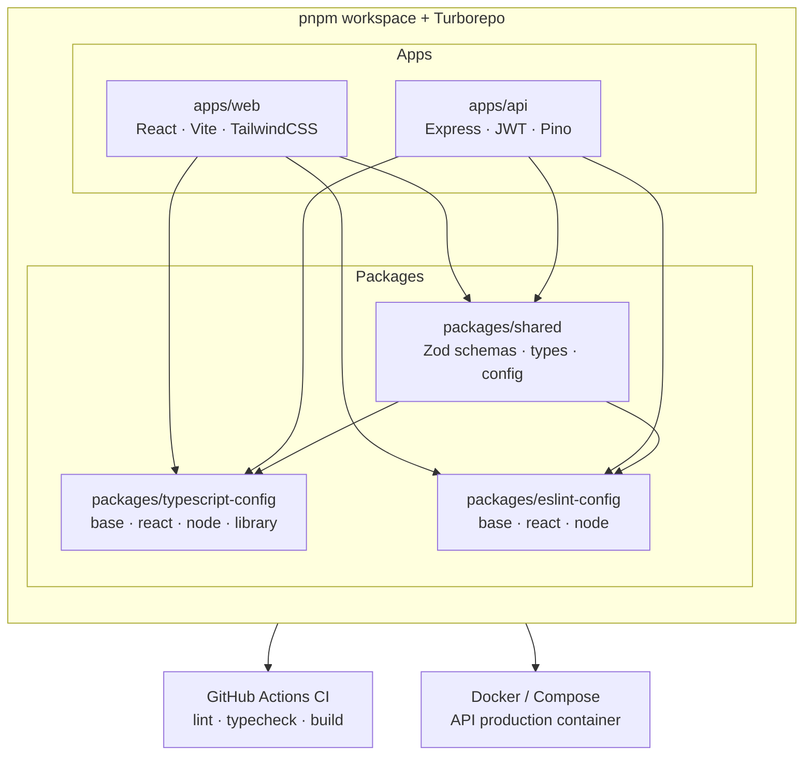

# Project Template

[](https://github.com/MANANPATEL7310/Template/actions/workflows/ci.yml)


> A centralized, TypeScript-first monorepo template for React + Express projects.
> Start from a real product shell — not a blank React starter.

---

## Architecture



## Stack

| Layer              | Tech                                                                                                                           |
| ------------------ | ------------------------------------------------------------------------------------------------------------------------------ |
| **Frontend**       | React 19, Vite 7, React Router v7, Zustand, React Query, Axios, React Hook Form, Zod, Tailwind CSS v4, Lucide, React Hot Toast |
| **Backend**        | Express 5, JWT auth, Zod env validation, Pino structured logging, Helmet                                                       |
| **Shared**         | Zod schemas, TypeScript types, app config, route constants                                                                     |
| **Tooling**        | Turborepo, pnpm workspaces, ESLint 9 flat config, Prettier, Husky + lint-staged                                                |
| **Infrastructure** | Docker multi-stage build, Docker Compose, GitHub Actions CI                                                                    |

## Quick Start

```bash
# 1. Clone
git clone https://github.com/MANANPATEL7310/Template.git my-project
cd my-project

# 2. Install
pnpm install

# 3. Set up environment
cp apps/web/.env.example apps/web/.env
cp apps/api/.env.example apps/api/.env

# 4. Run
pnpm dev
```

The web app starts on `http://localhost:5173` and the API on `http://localhost:4000`.

## Workspace Structure

```text
├── apps/
│   ├── api/                    # Express backend
│   │   ├── src/
│   │   │   ├── config/         # Env validation, logger
│   │   │   ├── constants/      # HTTP status codes
│   │   │   ├── lib/            # Async handler, request validation
│   │   │   ├── middleware/     # Auth guard, error handler, 404
│   │   │   ├── modules/        # Feature modules (auth, dashboard, health)
│   │   │   ├── routes/         # Route aggregator
│   │   │   └── types/          # Express augmentations
│   │   └── Dockerfile
│   └── web/                    # React frontend
│       └── src/
│           ├── app/            # Provider composition
│           ├── components/     # Shared + UI primitives
│           ├── config/         # Env, navigation
│           ├── features/       # Feature folders (auth, dashboard, marketing, settings)
│           ├── hooks/          # Global hooks
│           ├── lib/            # cn(), query client
│           ├── router/         # Route definitions
│           ├── services/       # Axios API client
│           ├── stores/         # Zustand stores
│           ├── styles/         # Tailwind + design tokens
│           ├── theme/          # Theme provider + palette
│           └── types/          # API types
├── packages/
│   ├── shared/                 # Cross-app schemas, types, config
│   ├── eslint-config/          # Shared ESLint presets
│   └── typescript-config/      # Shared TS config presets
├── .github/workflows/ci.yml   # GitHub Actions pipeline
├── docker-compose.yml          # Container orchestration
├── turbo.json                  # Turborepo task config
└── pnpm-workspace.yaml         # Workspace definition
```

## Scripts

| Command             | Description                     |
| ------------------- | ------------------------------- |
| `pnpm dev`          | Run web + API together          |
| `pnpm dev:web`      | Run web only                    |
| `pnpm dev:api`      | Run API only                    |
| `pnpm build`        | Build all workspaces            |
| `pnpm lint`         | Lint all workspaces             |
| `pnpm typecheck`    | Type-check all workspaces       |
| `pnpm format`       | Check formatting                |
| `pnpm format:write` | Fix formatting                  |
| `pnpm clean`        | Remove dist/node_modules/.turbo |
| `pnpm gen:module`   | Generate an API module          |
| `pnpm gen:feature`  | Generate a web feature          |
| `pnpm db:start`     | Start local Postgres via Docker |
| `pnpm db:push`      | Push Prisma schema to DB        |
| `pnpm db:studio`    | Open Prisma Studio              |
| `pnpm db:migrate`   | Create a Prisma migration       |
| `pnpm db:generate`  | Generate Prisma client          |

## Customizing the Template

### Renaming the project

1. Replace `@template/` prefix in all `package.json` files with your scope (e.g., `@myapp/`)
2. Update `appMeta` in `packages/shared/src/config/app.ts`
3. Update `storageKeys` prefixes in the same file
4. Change the `<title>` in `apps/web/index.html`

### Adding a new feature module (frontend)

```text
features/
  your-feature/
    api/           # Service functions calling the backend
    components/    # UI components scoped to this feature
    hooks/         # React Query hooks, form hooks
    pages/         # Page components for the router
    schemas/       # Zod schemas (or re-export from shared)
```

### Adding a new API module (backend)

```text
modules/
  your-module/
    your-module.controller.ts   # Request handlers
    your-module.routes.ts       # Express router
    your-module.service.ts      # Business logic
    your-module.schema.ts       # Zod validation (import from @template/shared)
```

Then register the router in `src/routes/index.ts`.

### Adding a database

1. The `db` service (Postgres) is already enabled in `docker-compose.yml`. Start it with `pnpm db:start`.
2. Add your ORM dependency (e.g., Prisma, Drizzle) to `apps/api`
3. Add `DATABASE_URL` to `apps/api/.env.example` and the Zod env schema

## Frontend Highlights

- Feature-folder architecture with clean separation of concerns
- Centralized semantic design tokens with light/dark theme support
- Token-based auth store with Zustand persist + Axios interceptors
- Protected route scaffolding with hydration guard
- React Error Boundary for crash recovery
- Pre-wired form, validation, notification, and query patterns
- CVA-based UI primitives (Button, Badge, Card, Input, Spinner)

## Backend Highlights

- Clean Express module boundaries (controller → service separation)
- Auth-ready JWT flow with middleware guard
- Shared Zod schemas between frontend and backend (zero drift)
- Structured logging with Pino (pretty in dev, JSON in prod)
- Multi-stage Docker build for minimal production images
- Health check endpoint at `/api/v1/health`

## Pre-commit Hooks

Husky + lint-staged runs automatically on every commit:

- **ESLint** on `*.ts`, `*.tsx`, `*.mjs` files
- **Prettier** on `*.ts`, `*.tsx`, `*.json`, `*.md`, `*.css`, `*.yml`

## Docker

```bash
# Build and run the API
docker compose up --build

# Or build the image directly
docker build -f apps/api/Dockerfile -t template-api .
```

## CI/CD

GitHub Actions runs on every push/PR to `main`:

1. **Install** — pnpm with lockfile verification
2. **Lint** — ESLint across all workspaces
3. **Typecheck** — TypeScript across all workspaces
4. **Build** — Production build of all packages and apps
